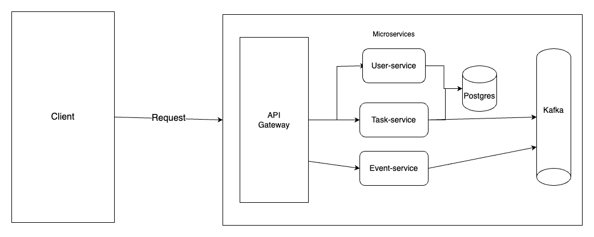
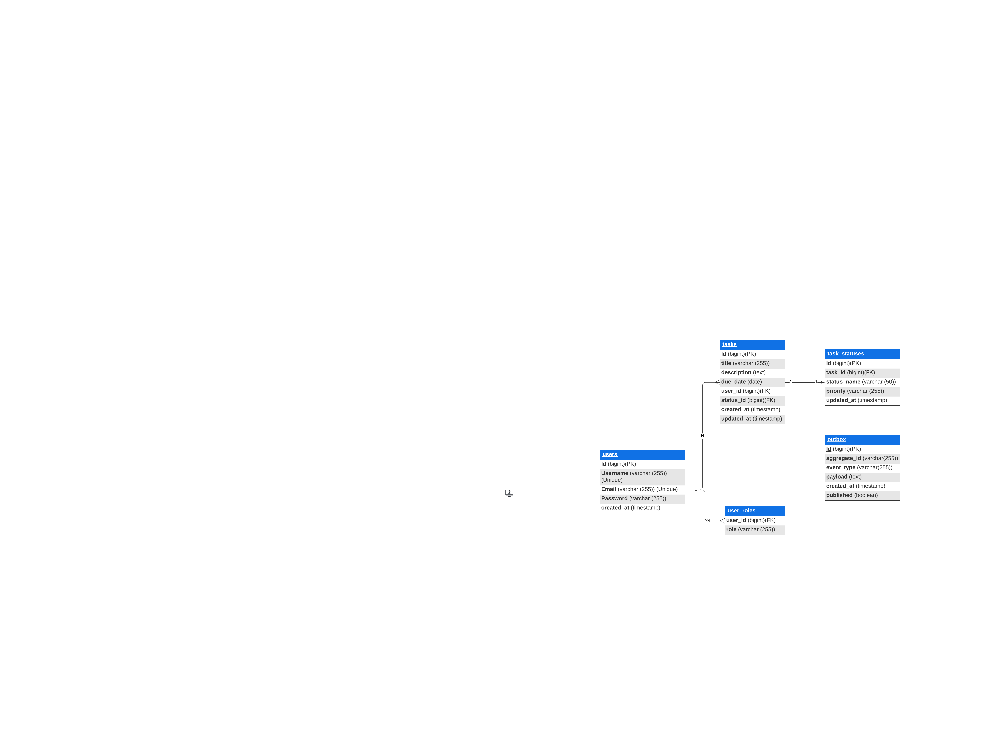
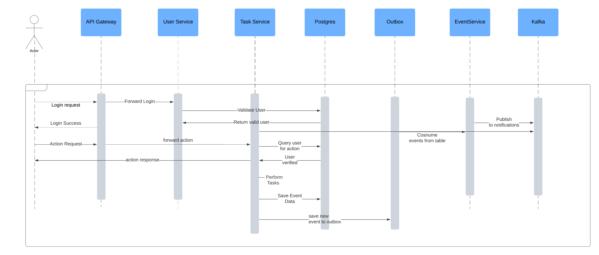
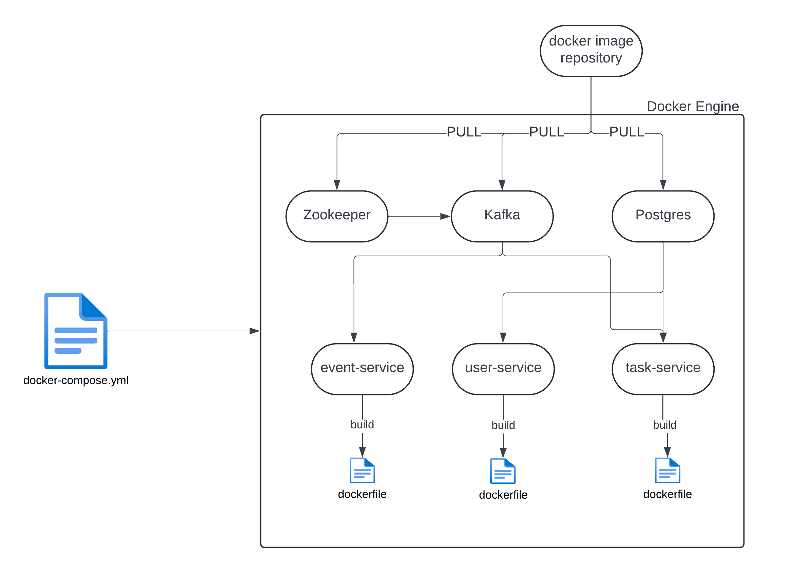

# Task Management System

Task management system is used to manage users and tasks. This project is a distributed system composed of multiple microservices designed to handle user management, task management, and event-driven notifications. The system is containerized using Docker and communicates via Kafka for asynchronous messaging. Each service is built to scale independently and supports modern microservices design patterns like the outbox pattern, API gateway, and event-driven architecture.

---

## Table of Contents
1. [Project Overview](#project-overview)
2. [Architecture](#architecture)
3. [Technology Stack](#technology-stack)
4. [Database Schema (ER Diagram)](#database-schema)
5. [Microservices](#microservices)
6. [Kafka Integration](#kafka-integration)
7. [Sequence Diagram](#sequence-diagram)
8. [Deployment Diagram](#deployment-diagram)
9. [Setup and Installation](#setup-and-installation)
10. [Running the Project](#running-the-project)
11. [API Documentation](#api-documentation)
12. [Design Decisions and Best Practices](#design-decisions-and-best-practices)

---

## Project Overview

This microservice-based system consists of the following services:
- **User Service**: Manages user registration, authentication, and role-based access control.
- **Task Service**: Handles the creation, updating, deletion and retrieval of tasks.
- **Event Service**: Sends notification to kafka whenever a new task is created, updated, deleted or mark as completed.
- **API Gateway**: Routes requests to appropriate services and handles cross-cutting concerns like authentication and logging.
- **Kafka**: Asynchronous message broker facilitating event-driven communication between microservices.

Each service is containerized with Docker, allowing easy scaling and isolated deployments.

---

## Architecture

The architecture follows a **microservice** pattern where each service can be deployed and scaled independently. Kafka is used for event-driven communication between the services, and the API Gateway acts as the single entry point for all client requests.



---

## Technology Stack

- **Java**: Backend programming language for all microservices.
- **Spring Boot**: Framework used to develop the microservices.
- **Spring Data JPA**: For database interaction.
- **PostgreSQL**: Relational database.
- **Kafka**: Messaging broker for asynchronous communication.
- **Docker**: Containerization for services.
- **API Gateway**: For routing and request management.
- **Zookeeper**: Required by Kafka for managing its cluster.
- **JWT (JSON Web Token)**: For securing API endpoints.

---

## Database Schema (ER Diagram)

The database is normalized with relations between users, tasks, task statuses, and event-driven outbox messages. The tables are structured as follows:

- **users**: Stores user details and authentication data.
- **tasks**: Stores task details such as name, description, priority, and status.
- **user_roles**: Maps users to their roles (admin, user).
- **task_statuses**: Stores different states of tasks (e.g., pending, completed).
- **outbox**: Stores events that are later consumed by the event service and published to Kafka.



---

## Microservices

### 1. **User Service**
- Manages user registration and authentication.
- Role-based access control for different users (admin, user).
- Stores user details in PostgreSQL.

### 2. **Task Service**
- Handles task creation, updates, deletion, and retrieval.
- Publishes events (task creation, update, or deletion) to the task-events topic for event-service to consume.

### 3. **Event Service**
- Consumes events from the task-events and publishes them to notifications topic.
- Handles event-driven notifications based on task events.

### 4. **API Gateway**
- Routes client requests to the appropriate microservice.
- Acts as a unified entry point for all microservices.
- Handles cross-cutting concerns like authentication, rate-limiting, and logging.

---

## Kafka Integration

Kafka is integrated to handle all event-driven communication between services, specifically:

- **Event Producers**: Task Service produces task-related events and publishes them to task-events topic.
- **Event Consumers**: Event Service reads the outbox events and publishes them to Kafka topics like `task-events`, which can trigger notifications.

---

## Sequence Diagram

This sequence diagram represents the flow of user interaction with the system, including login, task creation, and event-driven notifications.



---

## Deployment Diagram

This diagram represents how the application is deployed in containers using Docker. Each service is containerized and deployed on separate Docker containers with PostgreSQL and Kafka managed as separate services.



---

## Setup and Installation

### Prerequisites
- **Docker**: Ensure Docker is installed on your machine.
- **Java 11**: Ensure that Java 11 is installed to run the services locally if needed.
- **Maven**: For building the project.
- **Postman**: To test the API endpoints.

### Cloning the Project
```bash
git clone git@github.com:mrabhishek393/task-management-system.git
cd task-management-system
```

### Docker Compose
Run the following command to start all services using Docker Compose:
```bash
docker-compose up --build
```

This will spin up the following services:
- User Service on port `8081`
- Task Service on port `8082`
- Event Service on port `8083`
- PostgreSQL on port `5432`
- Kafka on port `9092`
- Zookeeper on port `2181`

---

## Running the Project

Once the containers are up and running, you can access the microservices through the following ports:
- **User Service**: `http://localhost:8081`
- **Task Service**: `http://localhost:8082`
- **Event Service**: `http://localhost:8083`
- **API Gateway**: `http://localhost:8080` (if integrated)

### Testing with Postman
- **Register a User**: Send a POST request to `/api/users/register`.
- **Create a Task**: After logging in, send a POST request to `/api/tasks/create`.
- **Event Service**: Internally listens for task events and sends notifications asynchronously via Kafka.

---

## API Documentation

### 1. **User Service**
- `POST /api/users/register`: Register a new user.
- `POST /api/users/login`: Log in to receive a JWT.

### 2. **Task Service**
- `POST /api/tasks/create`: Create a new task.
- `GET /api/tasks/{id}`: Retrieve a specific task by ID.
- `PUT /api/tasks/{id}`: Update a specific task.

### 3. **Event Service**
- Internally consumes events and sends notifications. No direct API endpoints.

---

## Design Decisions and Best Practices

### Scalability
- **Microservices**: Each service can scale independently. Task-heavy services like the Task Service can be scaled horizontally when necessary.
- **Kafka**: Kafka provides high throughput for event-driven messaging, allowing seamless communication between services.

### Resiliency
- **Circuit Breakers and Retries**: Failures in external dependencies (like Kafka or the database) are handled gracefully by retries or fallback mechanisms.
- **Dead Letter Queue (DLQ)**: Events that fail to process are routed to a DLQ for later inspection and recovery.

### Security
- **JWT Authentication**: All API requests are authenticated with JWT tokens.
- **API Gateway**: Centralized control over routing, logging, and authentication, ensuring security across services.

### Best Practices
- **Dockerized Services**: All services are containerized, ensuring that development, testing, and production environments are consistent.
- **Event-Driven Design**: The system leverages event-driven architecture to decouple services and handle real-time notifications.
- **Outbox Pattern**: Ensures reliable event publication by storing events in the database first and then asynchronously publishing to Kafka.

---

## Conclusion

This project follows a well-structured microservice architecture, leveraging Docker for containerization and Kafka for asynchronous event processing. The use of an API Gateway, JWT for authentication, and scalable services ensures the application is robust, scalable, and secure.

